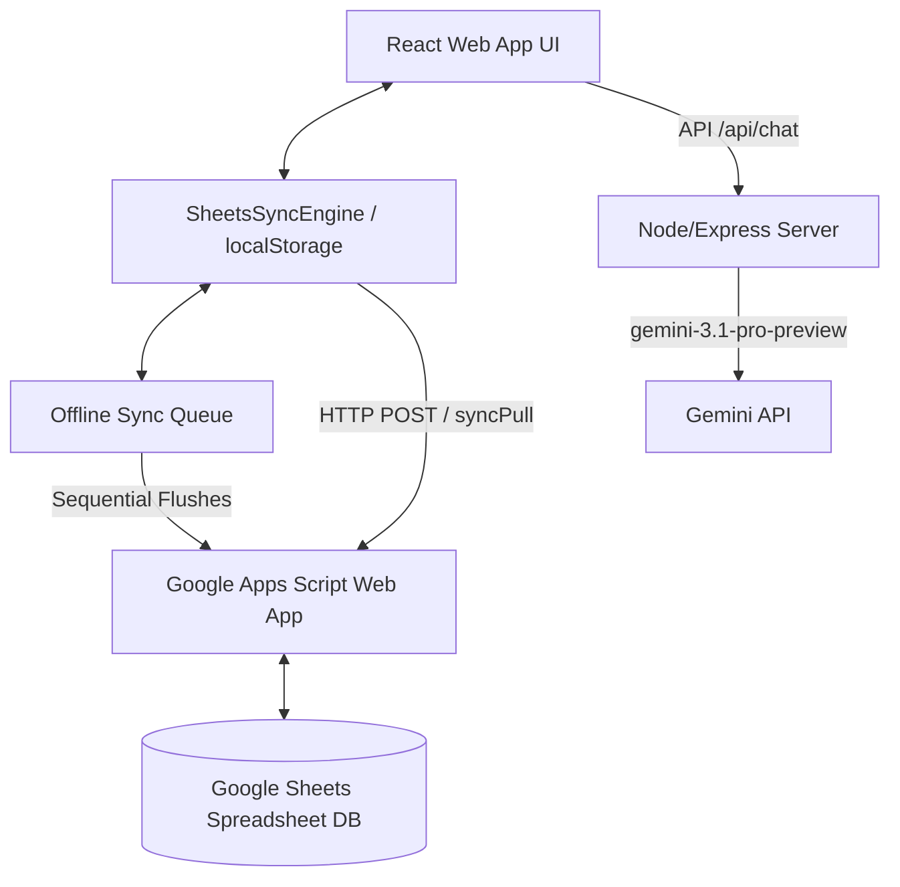

# TCF Smart Billing & ERP System (POS)

TCF Smart Billing is a modern, high-performance, offline-first Point of Sale (POS) and Enterprise Resource Planning (ERP) application designed for Tenali Central Furniture. It features a fully custom hierarchical product catalog, automated stock reconciliation, referral agent tracking, real-time Google Sheets database synchronization, and Gemini-powered business analytics.

---

## 🏗️ System Architecture

The application is built as a single-page React app served via a lightweight Node/Express server in development, compiling to static assets for production. It uses a hybrid offline-first storage model.



### Data Synchronization & Offline Cache Flow
1. **Local-First Writes**: Every user action (creating bills, adding products, registering customers) is saved immediately to `localStorage` (optimistic updates).
2. **Pushed Operations**: If connected, updates are pushed via POST requests to the Google Apps Script Web App. If the network is down, the request is wrapped in an offline transaction and queued in `localStorage` (`billing_sync_queue`).
3. **Queue Flushes**: Background tasks run periodically to attempt flushing failed transactions (`processSyncQueue`). The queue uses transaction-ID checks to prevent overwriting new local writes during async fetch phases.
4. **Merge Protocol**: When pulling remote data, the engine merges spreadsheet values with local changes. Legacy or deleted records in local storage are discarded *unless* they are currently in the offline queue waiting to be pushed.

---

## 📂 Project Structure

* **`server.ts`**: Express backend server. Manages configuration files (`dbConfig.json`) and handles proxies for Gemini AI endpoints (`/api/chat`).
* **`src/utils/sheetsSync.ts`**: Core database engine. Directs pull/push operations, manages local cache, processes transaction queues, and heals trees.
* **`src/utils/pdfGenerator.ts`**: Generates high-fidelity PDF receipts and invoices client-side.
* **`src/components/PosBilling.tsx`**: Point of Sale dashboard, checkout cart, customer registry shortcuts, and stock verification.
* **`src/components/ProductsTab.tsx`**: Interface for adding, editing, archiving, or deleting items from the hierarchical catalog.
* **`src/components/ProductTreeExplorer.tsx`**: Dynamic sidebar directory tree view mapping nested categories and SKUs.
* **`src/components/HistoryTab.tsx`**: Ledger of past bills. Manages invoice inspections, print requests, edits, and soft-deletes.
* **`src/components/RevenueAnalyticsTab.tsx`**: Advanced financial analytics, sales graphs, employee rankings, and agent referral metrics.

---

## 🌲 Hierarchical Catalog Engine

Products are modeled as an N-degree tree hierarchy rather than a flat table structure.

### Node Structure Levels
1. **Level 1: Category** (e.g. `Chair`) — Root category directories.
2. **Level 2: Product Model** (e.g. `Rocking Chair`) — Specific furniture items under a parent category.
3. **Level 3: Configuration** (e.g. `Standard` vs `Heavy`) — Spec dimensions, finishes, or quality classes.
4. **Level 4: SKU** (e.g. `Ball Model`, `Lion Model`) — Sellable inventory items with active pricing, dimensions, and barcodes.

### Key Algorithms & Utilities

#### 1. Self-Healing & Validation (`validateAndRepairProductTree`)
This routine validates and cleanses the raw JSON database:
* **Migration Handler**: Automatically runs legacy-to-tree schema migrations once on first run.
* **Cycle Breaking**: Traverses paths from child to parent recursively. If a parent link refers to a child (causing a circular dependency), it breaks the parenting loop to prevent infinite stack overflows.
* **Orphan Rescue**: If parent records are missing or deleted in the spreadsheet, orphans are auto-reassigned to valid fallback parent levels based on their node type.
* **NodeType Resolver**: Automatically guesses and repairs missing `nodeType` variables depending on their calculated hierarchy level.

#### 2. Root Category Propagation (`resolveCategoryName`)
Found in `ProductsTab.tsx` and `CategoryRegistryTable.tsx`, this utility resolves the category name of any leaf node or SKU dynamically by traversing parents up to the root category. This ensures nested SKUs maintain correct classification tags for POS categorization even if intermediate configurations are edited.

---

## 📈 Inventory & Accounting Rules

### Stock Deductions
During POS checkout, if an item's `inventoryType` is `"Stock Item"` (default), the app reduces availability:
* **Nested SKU Updates**: Decrements stock within the parent's `inventorySkus` array.
* **Color Variant Updates**: Decrements stock matching the selected color.
* **Product Totals**: Re-aggregates and saves total product stock across children nodes.

### Cancellations & Deletions
* **Cancellation**: Restores deducted item counts directly back to the active stock pools and reverses added revenue.
* **Soft Deletions**: Invoices status becomes `"Deleted"`. Transactions are archived and excluded from revenue analytics charts.

---

## 💻 Running & Deploying

### Prerequisites
* Install **Node.js** (v18.x or v20.x recommended)
* A Google Spreadsheet with Google Apps Script backend deployed.

### Setup Instructions
1. Clone / Extract the project files.
2. Install local dependencies:
   ```bash
   npm install
   ```
3. Initialize environment variables in `.env` (copying `.env.example`). Set `GEMINI_API_KEY` for AI features.
4. Start the development server:
   ```bash
   npm run dev
   ```
5. Open your web browser at `http://localhost:3000`.

### Build & Package for Production
To bundle and package client assets along with the Node server:
```bash
npm run build
```
This outputs compiled frontend assets to `/dist` and bundles a production-ready CJS server file to `/dist/server.cjs`.